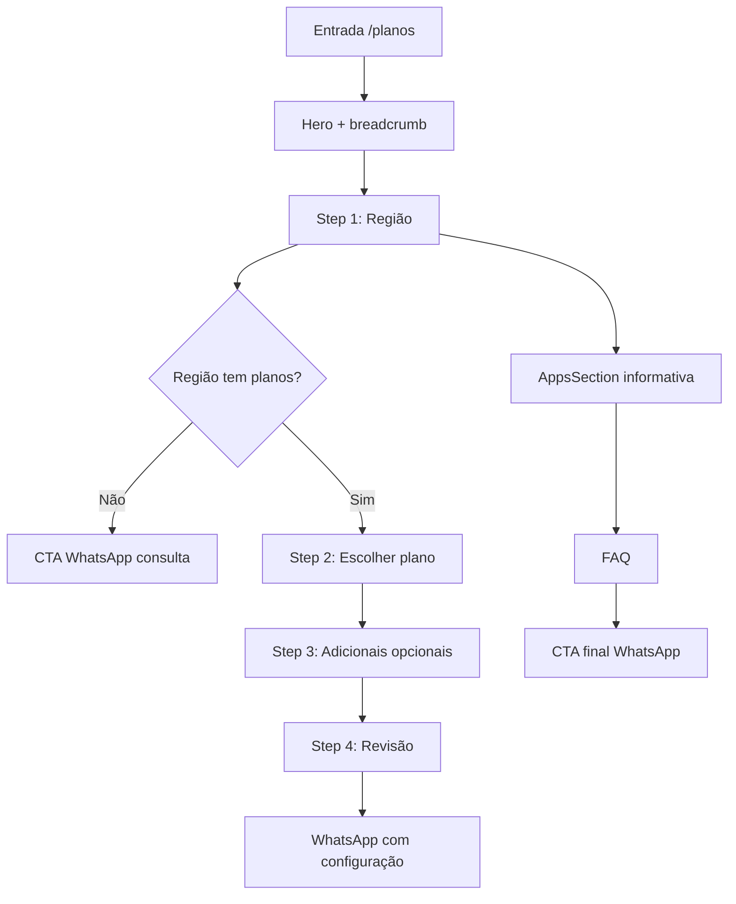

# Guia portável — Página de Planos RedeSub

Documento para replicar a funcionalidade de planos deste projeto em outro site.
Última revisão com base no código em **jul/2026**.

---

## Índice

1. [O que você está copiando](#1-o-que-você-está-copiando)
2. [Pacote mínimo vs pacote completo](#2-pacote-mínimo-vs-pacote-completo)
3. [Lista completa de arquivos (ordem de cópia)](#3-lista-completa-de-arquivos-ordem-de-cópia)
4. [Ordem de integração (passo a passo)](#4-ordem-de-integração-passo-a-passo)
5. [Modelo de dados](#5-modelo-de-dados)
6. [Estado global e persistência](#6-estado-global-e-persistência)
7. [Fluxo da página /planos](#7-fluxo-da-página-planos)
8. [Integração WhatsApp](#8-integração-whatsapp)
9. [Estilos CSS a extrair](#9-estilos-css-a-extrair)
10. [Assets públicos](#10-assets-públicos)
11. [SEO e rotas](#11-seo-e-rotas)
12. [Adaptação para Next.js / outro framework](#12-adaptação-para-nextjs--outro-framework)
13. [Checklist final](#13-checklist-final)
14. [Decisões de produto (não quebrar)](#14-decisões-de-produto-não-quebrar)

---

## 1. O que você está copiando

### Stack original

| Item | Valor |
|------|-------|
| Framework | React 19 + Vite |
| Roteamento | React Router 7 |
| UI | CSS customizado (sem Tailwind/MUI) |
| Dados | TypeScript hardcoded (sem CMS/API) |
| Conversão | Links `wa.me` com mensagem pré-preenchida |
| Estado | React Context + `localStorage` |

### Duas experiências distintas

| Onde | Componente | Comportamento |
|------|------------|---------------|
| Home | `PlansSection variant="preview"` | Preview rápido: filtro de região + cards + link "Ver todos" |
| `/planos` | `PlansPage` + `PlanConfigurator` | Wizard de 4 etapas + FAQ + CTA final |

### Hierarquia da página `/planos`

```
PlansPage
├── InternalPageHero              (breadcrumb + H1)
├── PlanConfigurator              (wizard principal)
│   ├── Stepper (Região → Plano → Adicionais → Revisão)
│   ├── RegionFilter
│   ├── PlansCarousel → PlanCard (modo selectable)
│   ├── Grid de adicionais (apps)
│   ├── PlanConfigSummary
│   └── PlanConfigFloatingBar     (barra fixa, só desktop)
├── AppsSection informativeOnly   (vitrine informativa)
├── FAQ                           (perguntas hardcoded)
└── CTA final + WhatsAppButton
```

---

## 2. Pacote mínimo vs pacote completo

### Pacote mínimo — preview na landing

Use quando só precisa de cards de plano na home, sem wizard.

**Arquivos obrigatórios:** 14  
**Tempo estimado:** 2–4 h (adaptando textos e CSS)

- Dados: `plans.ts`, `constants.ts`, `whatsapp.ts`
- Estado: `SelectionContext`, `useRegionSelection`
- UI: `PlanCard`, `RegionFilter`, `PlansSection`, `PlansCarousel`, `WhatsAppButton`
- Hooks: `useSnapCarousel`, `useMediaQuery` (opcional se usar só grid desktop)
- Extras úteis: `PlanAppSelector`, `AppIcon`, `config/apps.ts`

### Pacote completo — página `/planos` com wizard

**Arquivos obrigatórios:** ~30  
**Tempo estimado:** 1–2 dias (incluindo CSS e ajustes visuais)

Tudo do pacote mínimo, mais:

- Página: `PlansPage.tsx`
- Wizard: `PlanConfigurator`, `PlanConfigFloatingBar`
- Layout: `InternalPageHero`, `Breadcrumbs`
- Seções: `AppsSection` (modo informativo)
- UI: `FAQ`, `Reveal`
- Ícones: `components/icons/BenefitIcons.tsx` (barra flutuante)
- CSS completo do configurador, carrossel e floating bar

---

## 3. Lista completa de arquivos (ordem de cópia)

Copie nesta ordem para evitar imports quebrados.

### Fase A — Fundação (sem UI)

| # | Arquivo origem | Destino sugerido | Notas |
|---|----------------|------------------|-------|
| A1 | `src/lib/constants.ts` | `lib/constants.ts` | Altere `WHATSAPP_NUMBER` |
| A2 | `src/lib/plans.ts` | `lib/plans.ts` | Fonte única de regiões/planos |
| A3 | `src/config/apps.ts` | `config/apps.ts` | Catálogo de apps/adicionais |
| A4 | `src/lib/whatsapp.ts` | `lib/whatsapp.ts` | Mensagens e `buildWhatsAppLink` |
| A5 | `src/lib/scroll.ts` | `lib/scroll.ts` | Scroll entre etapas |

### Fase B — Hooks

| # | Arquivo origem | Destino sugerido |
|---|----------------|------------------|
| B1 | `src/hooks/useRegionSelection.ts` | `hooks/useRegionSelection.ts` |
| B2 | `src/hooks/useMediaQuery.ts` | `hooks/useMediaQuery.ts` |
| B3 | `src/hooks/useSnapCarousel.ts` | `hooks/useSnapCarousel.ts` |
| B4 | `src/hooks/usePageMeta.ts` | `hooks/usePageMeta.ts` |

### Fase C — Contexto global

| # | Arquivo origem | Destino sugerido |
|---|----------------|------------------|
| C1 | `src/context/SelectionContext.tsx` | `context/SelectionContext.tsx` |

> Envolva o app com `<SelectionProvider>` no root (equivalente a `App.tsx` linha 100).

### Fase D — Componentes base

| # | Arquivo origem | Depende de |
|---|----------------|------------|
| D1 | `src/components/AppIcon.tsx` | `config/apps.ts` |
| D2 | `src/components/WhatsAppButton.tsx` | `lib/whatsapp.ts` |
| D3 | `src/components/ui/Reveal.tsx` | — (Intersection Observer) |
| D4 | `src/components/ui/Breadcrumbs.tsx` | React Router `Link` |
| D5 | `src/components/ui/FAQ.tsx` | — |
| D6 | `src/components/icons/BenefitIcons.tsx` | — (SVGs inline) |

### Fase E — Componentes de planos

| # | Arquivo origem | Depende de |
|---|----------------|------------|
| E1 | `src/components/RegionFilter.tsx` | `SelectionContext`, `plans.ts` |
| E2 | `src/components/PlanAppSelector.tsx` | `AppIcon`, `config/apps.ts` |
| E3 | `src/components/PlanCard.tsx` | acima + `whatsapp.ts` |
| E4 | `src/components/PlansCarousel.tsx` | `PlanCard`, `useSnapCarousel` |
| E5 | `src/components/PlanConfigFloatingBar.tsx` | `BenefitIcons`, `useMediaQuery` |
| E6 | `src/components/PlanConfigurator.tsx` | todos acima |
| E7 | `src/components/layout/InternalPageHero.tsx` | `Breadcrumbs` |

### Fase F — Seções e página

| # | Arquivo origem | Uso |
|---|----------------|-----|
| F1 | `src/sections/PlansSection.tsx` | Preview na home |
| F2 | `src/sections/AppsSection.tsx` | Vitrine de apps |
| F3 | `src/pages/PlansPage.tsx` | Página `/planos` |
| F4 | `src/config/site.ts` | SEO + nav (trecho `PAGE_META.planos`) |

### Fase G — Rota

| # | Arquivo origem | Trecho |
|---|----------------|--------|
| G1 | `src/App.tsx` | Lazy import + `<Route path="/planos" ...>` |

### Fase H — Estilos

| # | Arquivo origem | Blocos relevantes |
|---|----------------|-------------------|
| H1 | `src/styles/global.css` | Ver [seção 9](#9-estilos-css-a-extrair) |
| H2 | `src/styles/site.css` | Ver [seção 9](#9-estilos-css-a-extrair) |

### Fase I — Assets

| # | Origem | Destino |
|---|--------|---------|
| I1 | `public/app-icons/*.png` | `public/app-icons/` |

### Fase J — Testes (opcional)

| # | Arquivo origem |
|---|----------------|
| J1 | `src/lib/plans.test.ts` |

---

## 4. Ordem de integração (passo a passo)

### Passo 1 — Configurar constantes

```ts
// lib/constants.ts
export const WHATSAPP_NUMBER = "55XXXXXXXXXXX"; // sem + ou espaços
```

### Passo 2 — Cadastrar regiões e planos

Edite `lib/plans.ts`:

```ts
export const REGIONS = [
  {
    id: "sua-regiao",
    name: "Nome da Região",
    areaLabel: "Bairros cobertos (opcional)",
    plans: [
      {
        id: "basico",
        name: "Básico",
        speed: "450 Mega",
        price: "99,90",
        profile: "Texto do perfil de uso",
        features: ["Feature 1", "Feature 2"],
        recommended: false,
        badge: null,
      },
      // ...
    ],
  },
  {
    id: "regiao-sem-planos",
    name: "Outra Região",
    plans: [], // → exibe CTA "Consultar disponibilidade"
  },
] as const;
```

Altere também:
- `REGION_STORAGE_KEY` → ex: `"meusite-selected-region"`
- `DEFAULT_REGION_ID` → região padrão na home

### Passo 3 — Montar o provider global

```tsx
// main.tsx ou App.tsx
import { SelectionProvider } from "./context/SelectionContext";

<SelectionProvider>
  <RouterProvider ... />
</SelectionProvider>
```

### Passo 4 — Adicionar preview na home

```tsx
import PlansSection from "./sections/PlansSection";

<PlansSection variant="preview" />
```

### Passo 5 — Criar rota `/planos`

```tsx
const PlansPage = lazy(() => import("./pages/PlansPage"));

<Route path="/planos" element={<SiteLayout><PlansPage /></SiteLayout>} />
```

### Passo 6 — Importar CSS

Garanta que os blocos listados na [seção 9](#9-estilos-css-a-extrair) estejam carregados **depois** dos tokens/variáveis de cor do seu site.

### Passo 7 — Personalizar textos

| O que | Onde |
|-------|------|
| FAQ da página | `PLANS_FAQ` em `PlansPage.tsx` |
| Mensagens WhatsApp | `lib/whatsapp.ts` |
| SEO | `PAGE_META.planos` em `config/site.ts` |
| Nome da marca nas mensagens | buscar "RedeSub" em `whatsapp.ts` |

### Passo 8 — Validar fluxos

- [ ] Home: trocar região → cards atualizam
- [ ] Home mobile: carrossel funciona
- [ ] Região sem planos → botão WhatsApp de consulta
- [ ] `/planos`: wizard completo 4 etapas
- [ ] Desktop: barra flutuante aparece ao scrollar
- [ ] CTA final monta mensagem correta
- [ ] `localStorage` persiste região entre páginas

---

## 5. Modelo de dados

### Plan

```ts
interface Plan {
  id: string;              // slug, usado em PLAN_APP_CONFIG
  name: string;            // "Segurança"
  speed: string;           // "650 Mega" — parseado por parsePlanSpeed()
  price: string;           // "175,90" — SEM "R$", vírgula decimal
  profile: string;         // texto "Indicado para..."
  features: readonly string[];
  recommended: boolean;    // destaque visual no card
  badge: string | null;    // ex: "Melhor escolha para famílias"
}
```

### Region

```ts
interface Region {
  id: string;              // slug → localStorage
  name: string;            // label no filtro
  areaLabel?: string;      // subtítulo "Ilha de Outeiro · ..."
  plans: readonly Plan[];  // [] = fluxo consulta WhatsApp
}
```

### Apps por plano

```ts
// config/apps.ts
PLAN_APP_CONFIG = {
  basico: {
    includedAppIds: [],                    // apps já inclusos
    additionalAppIds: [...DEFAULT_ADDITIONAL_APP_IDS],
  },
};
```

---

## 6. Estado global e persistência

### SelectionContext expõe

```ts
{
  regionId: string | null;
  regionName: string | null;
  selectedPlanId: string | null;
  selectedAddonIds: string[];
  setRegionId(id);
  setSelectedPlanId(id);
  toggleAddon(id);
  clearAddons();
}
```

### Comportamentos importantes

| Situação | Comportamento |
|----------|---------------|
| Usuário escolhe região | Salva em `localStorage` (`REGION_STORAGE_KEY`) |
| Usuário entra em `/planos` | **Reseta** região, plano e adicionais (`useLayoutEffect`) |
| Troca região no wizard | Limpa plano + adicionais, vai para step 2 |
| Troca plano | Limpa adicionais |
| Home sem região selecionada | Usa `DEFAULT_REGION_ID` para exibir planos |

> Se no seu site quiser **manter** a região ao entrar em `/planos`, remova o `setRegionId(null)` do `useLayoutEffect` em `PlansPage.tsx`.

---

## 7. Fluxo da página /planos



### PlanCard — dois modos

| Modo | Prop | CTA | App selector |
|------|------|-----|--------------|
| Home | `selectable={false}` | Link WhatsApp | `PlanAppSelector` (1 app) |
| Wizard | `selectable={true}` | Botão selecionar | Oculto |

### Carrossel vs grid

| Viewport | Home | Wizard |
|----------|------|--------|
| `< 768px` | Carrossel | Carrossel |
| `≥ 768px` | Grid 3 colunas | Carrossel (cards large) |

Breakpoint: `(max-width: 767px)` em `PlansSection`; `(min-width: 768px)` na barra flutuante.

### Barra flutuante (desktop)

- Componente: `PlanConfigFloatingBar`
- Renderiza via `createPortal(..., document.body)`
- Visível quando scroll passa o topo do configurador
- Oculta quando `#plans-cta` entra na viewport (~12%)
- Adiciona `body.has-plans-summary` → padding-bottom + reposiciona FAB WhatsApp

---

## 8. Integração WhatsApp

### Função base

```ts
buildWhatsAppLink(message: string): string
// → https://wa.me/559129920014?text=...
```

### Mensagens usadas na página de planos

| Função | Quando |
|--------|--------|
| `WHATSAPP_MESSAGES.planConfiguration({...})` | Revisão final / CTA com plano |
| `WHATSAPP_MESSAGES.plansConsult(region)` | Sem plano selecionado |
| `WHATSAPP_MESSAGES.regionAvailability(name)` | Região sem planos |
| `WHATSAPP_MESSAGES.planWithApp(...)` | Card na home com app |

### Exemplo — mensagem de configuração

```
Olá! Vim pelo site da RedeSub e gostaria de consultar esta configuração.

Região: Oteiro
Plano: Segurança
Velocidade: 650 Mega
Mensalidade exibida: R$ 175,90/mês
Adicionais: Disney+, Telecine

Poderiam confirmar a disponibilidade e o valor final para meu endereço?
```

### Componente CTA

```tsx
<WhatsAppButton
  message={finalMessage}
  label="Falar com a RedeSub pelo WhatsApp"
  variant="primary"
  size="lg"
/>
```

---

## 9. Estilos CSS a extrair

### Pré-requisitos (design tokens)

Antes dos blocos de planos, seu CSS precisa definir variáveis equivalentes:

```css
--brand-blue, --brand-blue-rgb, --brand-blue-soft
--brand-navy, --brand-orange
--brand-white, --text-secondary, --border
--radius-md, --radius-lg, --radius-xl, --radius-full
--shadow-sm, --shadow-md, --shadow-lg
--font, --container, --transition
```

### global.css — blocos obrigatórios

| Classe / bloco | Linhas aprox. | Uso |
|----------------|---------------|-----|
| `.btn`, `.btn--*` | ~100–193 | CTAs em todo o fluxo |
| `.section`, `.section__*` | ~46–79 | Layout de seções |
| `.plans`, `.plans__grid` | ~829–856 | Grid de cards |
| `.plan-card` (+ variantes) | ~865–1160 | Cards de plano |
| `.plan-app-selector` | ~1166–1410 | Dropdown app (home) |
| `.app-icon` | ~1364–1394 | Ícones de apps |
| `.apps`, `.apps-showcase` | ~1422–1510 | Vitrine AppsSection |
| `.apps-addons` | ~2965+ | Grid de adicionais |
| `.region-filter` | ~2791–2844 | Filtro de região |
| `.plans__region-note`, `.plans__empty` | ~2845–2872 | Estados vazios |

### site.css — blocos obrigatórios

| Classe / bloco | Linhas aprox. | Uso |
|----------------|---------------|-----|
| `.internal-page-hero` | ~390–488 | Hero interno |
| `.plans__grid--large`, `.plan-card--large` | ~1198–1216 | Cards grandes |
| `.plan-card--selected` | ~1218–1235 | Plano selecionado |
| `.plans-configurator-*` | ~1249–1567 | Wizard completo |
| `.plans-carousel-*` | ~1568–1688 | Carrossel |
| `.floating-summary*` | ~1690–1832 | Barra flutuante |
| `.plans-cta*` | ~2016–2054 | CTA final |
| `.plans-faq__intro` | ~2054 | FAQ |

### Modificadores de seção usados

```css
.section--soft    /* fundo suave — configurador */
.section--muted   /* fundo alternativo — FAQ */
.section--alt     /* AppsSection */
.container--narrow /* FAQ */
```

---

## 10. Assets públicos

### Ícones de apps (`public/app-icons/`)

| Arquivo | App |
|---------|-----|
| `sky.png` | Sky+ |
| `prime-video.png` | Prime Video |
| `globoplay.png` | Globoplay |
| `telecine.png` | Telecine |
| `disney-plus.png` | Disney+ |
| `hbo-max.png` | HBO Max |
| `apple-tv.png` | Apple TV+ |
| `paramount.png` | Paramount+ |

Apps sem ícone usam fallback tipográfico via `AppIcon`.

---

## 11. SEO e rotas

### Meta da página

```ts
// config/site.ts
planos: {
  title: "Planos de internet | Nome do Site",
  description: "Escolha seu plano de fibra por região...",
  path: "/planos",
}
```

### Hook

```tsx
// PlansPage.tsx
usePageMeta(PAGE_META.planos);
```

Define: `document.title`, `meta description`, Open Graph, canonical (se `VITE_SITE_URL` existir).

### Navegação sugerida

```ts
{ label: "Planos", path: "/planos" }
```

Links internos úteis:
- `#plan-configurator` — voltar ao wizard
- `#plans-cta` — CTA final
- `#planos` — seção na home

---

## 12. Adaptação para Next.js / outro framework

### React Router → Next.js App Router

| Original | Next.js |
|----------|---------|
| `PlansPage.tsx` | `app/planos/page.tsx` |
| `usePageMeta()` | `export const metadata = {...}` |
| `Link to="/planos"` | `<Link href="/planos">` |
| `lazy(() => import(...))` | não necessário |
| `SelectionProvider` no root | `app/providers.tsx` |

### Client Components

Estes arquivos precisam de `"use client"` no Next.js:

- `SelectionContext.tsx`
- `PlanConfigurator.tsx`
- `PlansCarousel.tsx`
- `PlanConfigFloatingBar.tsx`
- `RegionFilter.tsx`
- `PlanCard.tsx` (usa useState)
- `PlansSection.tsx`
- `useRegionSelection.ts` (localStorage)
- `useSnapCarousel.ts`, `useMediaQuery.ts`, `usePageMeta.ts`

### localStorage

Só acessar dentro de `useEffect` / handlers — o hook `useRegionSelection` já trata SSR com guard `typeof window`.

### createPortal

`PlanConfigFloatingBar` usa portal no `document.body` — funciona no Next.js com `"use client"`.

---

## 13. Checklist final

### Configuração

- [ ] `WHATSAPP_NUMBER` atualizado
- [ ] `REGIONS` e planos cadastrados
- [ ] `REGION_STORAGE_KEY` renomeada
- [ ] `PLAN_APP_CONFIG` mapeado por plano
- [ ] Textos "RedeSub" substituídos
- [ ] `VITE_SITE_URL` (ou equivalente) para canonical

### Funcional

- [ ] Preview na home renderiza planos
- [ ] Filtro de região funciona
- [ ] Região vazia → CTA consulta
- [ ] Carrossel mobile (setas, dots, teclado)
- [ ] Wizard 4 etapas completo
- [ ] Adicionais toggle multi-seleção
- [ ] Revisão monta resumo correto
- [ ] WhatsApp abre com mensagem correta
- [ ] Barra flutuante desktop
- [ ] FAQ accordion
- [ ] Breadcrumb e hero interno

### Visual

- [ ] Plano `recommended` destacado
- [ ] Card selecionado com borda azul
- [ ] Preço formatado (parte inteira + centavos)
- [ ] Responsivo mobile (stepper scroll horizontal)
- [ ] `prefers-reduced-motion` respeitado

### Acessibilidade

- [ ] `role="radiogroup"` no filtro de região
- [ ] `aria-current="step"` no stepper
- [ ] `aria-pressed` nos adicionais
- [ ] Labels em preços (`aria-label`)
- [ ] Carrossel com `aria-roledescription="carrossel"`

### Testes (opcional)

```bash
npm test   # plans.test.ts + whatsapp.test
```

---

## 14. Decisões de produto (não quebrar)

1. **Sem checkout** — toda conversão vai para WhatsApp
2. **Sem preço de adicionais** — "confirmar com atendimento"
3. **Regiões sem planos não inventam dados** — só CTA de consulta
4. **Home = descoberta**; `/planos` = funil guiado
5. **Preço como string** `"175,90"` — não usar number (formatação BR)
6. **Um plano `recommended: true`** — destaque visual principal
7. **Entrada em `/planos` reseta seleção** — evita estado inconsistente

---

## Referência rápida — árvore de dependências

```
lib/plans.ts ─────────────────────────┐
lib/constants.ts ── lib/whatsapp.ts ──┤
config/apps.ts ───────────────────────┤
                                      ▼
                          SelectionContext
                                      │
         ┌────────────────────────────┼────────────────────────────┐
         ▼                            ▼                            ▼
  RegionFilter                  PlanCard                    AppsSection
         │                            │
         │                     PlansCarousel
         │                            │
         └──────────────► PlanConfigurator ◄── PlanConfigFloatingBar
                                      │
                                 PlansPage
```

---

## Arquivos deste repositório (referência)

```
src/
├── pages/PlansPage.tsx
├── sections/PlansSection.tsx
├── sections/AppsSection.tsx
├── components/
│   ├── PlanConfigurator.tsx
│   ├── PlanCard.tsx
│   ├── PlansCarousel.tsx
│   ├── PlanConfigFloatingBar.tsx
│   ├── PlanAppSelector.tsx
│   ├── RegionFilter.tsx
│   ├── WhatsAppButton.tsx
│   ├── AppIcon.tsx
│   ├── layout/InternalPageHero.tsx
│   ├── ui/FAQ.tsx, Reveal.tsx, Breadcrumbs.tsx
│   └── icons/BenefitIcons.tsx
├── context/SelectionContext.tsx
├── hooks/
│   ├── useRegionSelection.ts
│   ├── useSnapCarousel.ts
│   ├── useMediaQuery.ts
│   └── usePageMeta.ts
├── lib/plans.ts, whatsapp.ts, scroll.ts, constants.ts
└── config/apps.ts, site.ts

public/app-icons/*.png
src/styles/global.css   (plan-card, region-filter, apps)
src/styles/site.css     (configurator, carousel, floating bar)
```

---

*Gerado a partir do projeto RedeSub — use como blueprint; adapte tokens, textos e dados ao novo site.*
